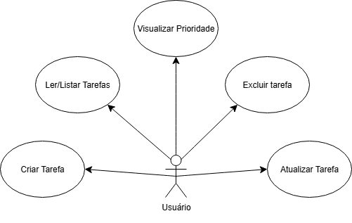

 
# Construindo um Projeto Ágil no GitHub: Da Gestão ao Controle de Qualidade

## 🎯 Objetivo do Projeto
Desenvolver um sistema de gerenciamento de tarefas utilizando metodologias ágeis, permitindo à startup cliente acompanhar o fluxo de trabalho em tempo real, priorizar tarefas críticas e monitorar o desempenho da equipe.

## 📦 Escopo
- CRUD básico de tarefas
- Campo de prioridade
- Interface em linha de comando (terminal)
- Integração com testes automatizados

## 🚀 Metodologia Adotada
A metodologia usada foi o **Kanban**, implementado usando a aba **Projects** do GitHub. As tarefas foram organizadas nas colunas:
- A Fazer
- Em Progresso
- Concluído

## ⚙️ Como Executar
Requisitos: Python 3 instalado

```bash
python src/app.py

✅ Testes Automatizados
Os testes são executados automaticamente via GitHub Actions ao fazer push no repositório. Os testes estão localizados na pasta tests.

🔁 Mudança no Escopo
Durante o desenvolvimento, foi simulada uma mudança de escopo solicitada pelo cliente, que incluiu a adição de prioridade nas tarefas. O CRUD foi ajustado para aceitar esse novo atributo.

📊 Diagramas UML
Os diagramas de Casos de Uso e Classes estão disponíveis na pasta /docs, criados com a ferramenta draw.io.

👤 Autor
Guilherme L. dos Santos (GuILS00)

# TechFlow Agile System

## 🎯 Objetivo
Criar um sistema simples de gerenciamento de tarefas utilizando metodologias ágeis (Kanban) e boas práticas de Engenharia de Software.

## 📌 Escopo
- CRUD de tarefas com título e status
- Testes automatizados com GitHub Actions
- Simulação de mudança no escopo
- Gestão de tarefas com GitHub Projects

## 🛠️ Metodologia
- **Kanban** (GitHub Projects)
- **GitHub Actions** para integração contínua
- **Commits frequentes e bem descritos**

## ▶️ Como Executar
1. Clone o repositório:

git clone https://github.com/seuusuario/techflow-agile-system.git
cd techflow-agile-system

2. Instale as dependências:


## 🔁 Mudança no Escopo
Durante o projeto, decidimos **adicionar uma categoria às tarefas** para simular um novo requisito. O código e o Kanban foram atualizados para refletir isso.

## 🧩 Modelagem UML

### 📌 Diagrama de Casos de Uso



